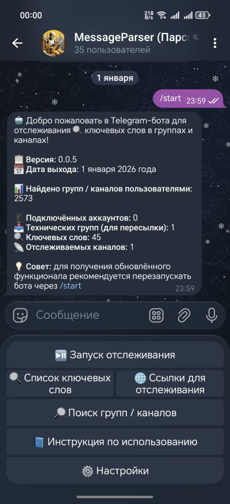

### 📡 Telegram бот для отслеживания ключевых слов в группах и каналах (https://t.me/AutoParseAlertBot)

- Версия: 0.0.5
- Дата выхода: 1 января 2026 года

Бот анализирует новые сообщения в указанных Telegram-группах и каналах, проверяя их на наличие заданных ключевых слов,
а также ищет с помощью ИИ группы и каналы Telegram с последующей выдачей пользователю бота в личку.

<div style="text-align: center;">
  
</div>

## 📝 Доступные функции

- Отслеживание ключевых слов в группах и каналах
- Пересылка сообщений с ключевыми словами в указанный канал
- Управление аккаунтами Telegram
- Получение логов работы бота по команде /log

🗂 Структура проекта

- Файл локализации: `locales/locales.py`

Используется для перевода интерфейса и сообщений бота на разные языки.

- Аккаунты Telegram:
  Для работы бота необходимы аккаунты в формате `.session`.

Каждая сессия хранится в каталоге:

```text

accounts/<id_user>/<account_name>.session
```

Где:

* <id_user> — Telegram ID пользователя, который загрузил аккаунт в бота;
* <account_name>.session — сессия Telegram-аккаунта, используемого для мониторинга сообщений.

Группы для парсинга вносятся в формате @username и записываются в базу данных bot.db

Группа для пересылки сообщений, должна быть в формате @username, что бы аккаунт мог подписаться на данную группу.

## ⚙️ Установка

Запустите файл setup.py, далее установятся все необходимые библиотеки из файла `requirements.txt`, и будет создан .env
файл.

Структура .env файла:

```text

BOT_TOKEN=_____
ID=_____
HASH=_____
```

Заполните данные в файле .env

где:

- BOT_TOKEN - токен бота
- ID - id приложения Telegram
- HASH - hash приложения Telegram
